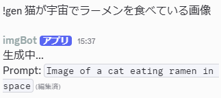
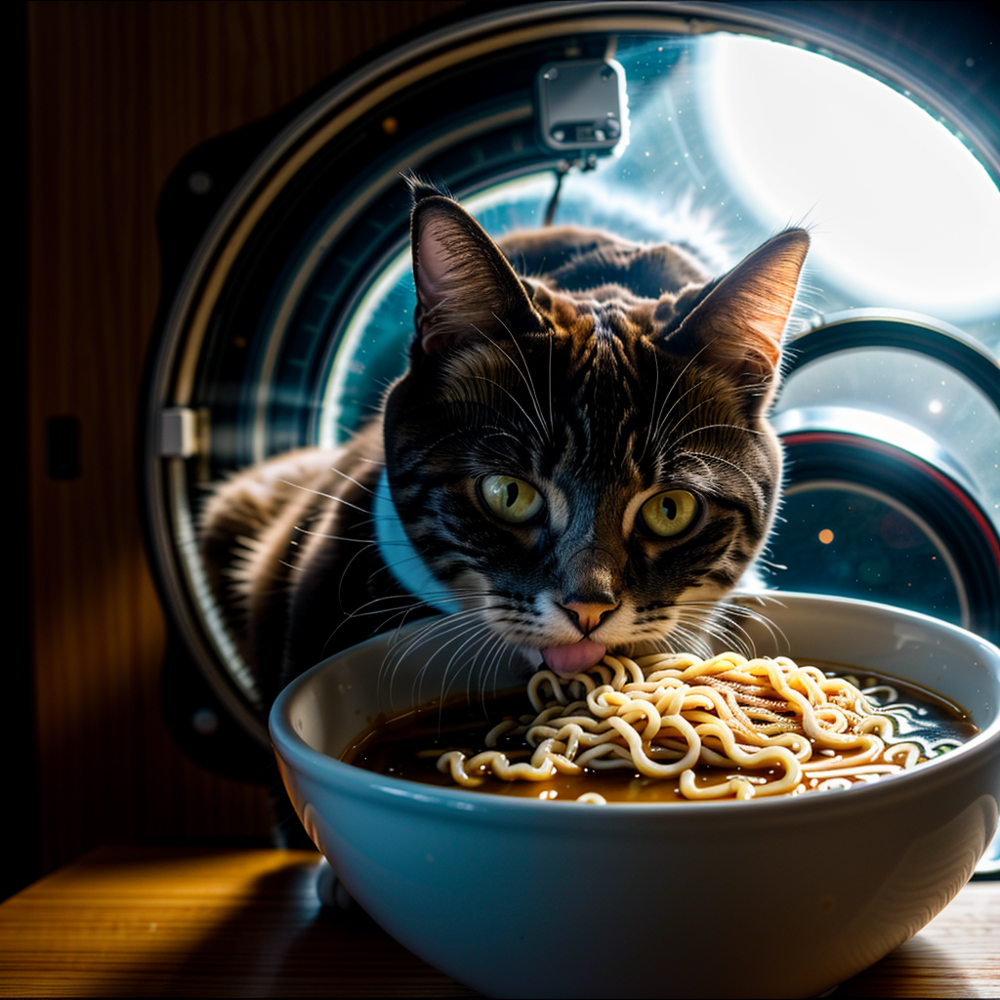
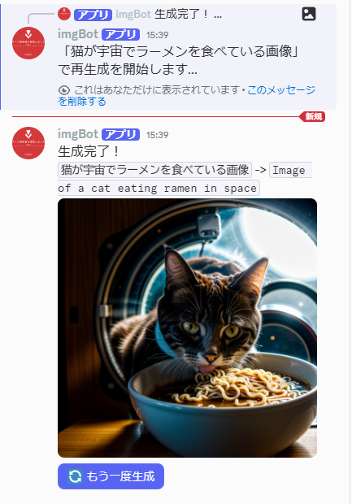
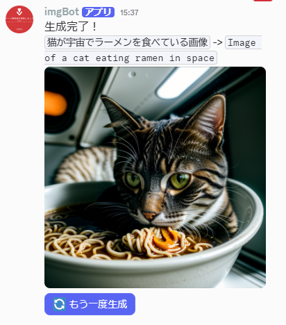

# Discord 4070 Image Gen Bot (Unlimited Translator)

### 概要
ローカルのGPU（NVIDIA RTX 4070）パワーを活用し、Discordから手軽に高画質な画像を生成するためのBot。
「日本語で指示したいが、既存サービスの制限には縛られたくない」という課題を技術で解決した。


### 開発背景
自ら作成・管理しているDiscordサーバーには、「しょうもない画像を生成して、しょうもない会話で盛り上がる」のが好きな仲間が集まっている。

しかし、市販の画像生成AIサービスには「生成回数の制限」や「月額課金」の壁があった。**「ただ仲間とふざけるためだけに課金するのは、エンジニアとして負けではないか？」**という強い想いから、自前のゲーミングPC（RTX 4070）を常時稼働のAPIサーバーとして開放することを決意した。

自分のサーバーの仲間なら誰でも・何枚でも・無料で「最高にくだらない画像」を生成し、コミュニティの熱量を最大化するために本Botを開発した。


### 使用例（Demo）
「宇宙でラーメンを食べる猫」というリクエストに対する、Botの一連の動きと生成例。

**1. Discordでの入力と翻訳** 

日本語の指示を、Botが自動的にネイティブな英語プロンプトへ翻訳します。

<div align="center">
  
</div>

---

**2. 生成された画像** 

RTX 4070のパワーを活かした、フォトリアルで完璧な生成結果です。

<div align="center">
  
</div>

---

**3. 生成完了とインタラクティブUI** 

翻訳後のプロンプトと一緒に画像が出力されます。

<div align="center">
  
</div>

---

**4. AIのシュールな解釈** 

たまにAIが「猫をラーメン鉢の中」に入れちゃうようなボケを披露します。  
**この「しょうもない」結果こそが、このBotがサーバーで愛される理由の一つです。**

<div align="center">
  
</div>


### 特徴
- **無限翻訳システム**: Gemini APIの制限を回避するため、`deep-translator`（Google翻訳エンジン）を組み込み、24時間365日、制限なしのプロンプト入力を実現。
- **実写特化オートプリセット**: プロンプトに `RAW photo`, `8k uhd` などの高品質タグを自動付与。知識がなくても一瞬でプロ級の画像を生成できる。
- **インタラクティブUI**: DiscordのButton機能を採用。同じプロンプトでの再生成をボタン一つで実行できるようにして、使い勝手を向上させた。
- **ローカルAPI連携**: Stable Diffusion WebUI (Automatic1111) のAPIモードを利用。高速かつプライベートな生成環境を構築。
- **一括起動オートメーション**: 複雑なパス指定や仮想環境の有効化を自動化したバッチファイルを完備。ワンクリックでシステム全体が立ち上がる。


### 使用技術
- **Language**: Python 3.10
- **Main Libraries**: 
  - `discord.py` (Bot Interface)
  - `google-genai` (Chat/Support AI)
  - `deep-translator` (High-speed Translation)
- **Hardware**: NVIDIA GeForce RTX 4070
- **Environment**: Python venv (`venv_bot`)


### 使い方 (Usage)
1. Discordサーバーの専用チャンネルで `!gen [内容]` と入力。
2. 数秒で画像が生成される。
3. 気に入らなければ、画像下の「🔄 もう一度生成」ボタンをクリックするだけ。


### 今後の課題・改良予定 (Future Plans)
1. **翻訳プロンプトの補正機能**: 
   ネットスラングとかで翻訳が不安定になることがあるから、Geminiで文脈を補正する機能の統合を検討中。
2. **複数モデルの切り替え**: 
   実写系だけじゃなく、アニメ系モデルとかにDiscord上からスイッチできる機能の実装。


### セットアップ
ご自身のPCで動作させる場合は、以下のコマンドを順番に実行してください。

1. **リポジトリのクローン**: ターミナル（コマンドプロンプト）を開き、プロジェクトをダウンロードしてディレクトリに移動します。
```bash
git clone https://github.com/ryujp1/Discord-image-gen-bot.git
```
2. **必要なライブラリのインストール**: 
```bash
pip install -r requirements.txt
```

3. **Stable Diffusion**: WebUIを `--api` 引数をつけて起動。
4. **環境変数**: `.env` に `DISCORD_TOKEN` と `GEMINI_API_KEY` を設定。
5. **起動**: ターミナル（コマンドプロンプト）を開き、本プロジェクトのフォルダで `python image_gen_bot.py` でスタート。一括起動する場合は、後述のバッチファイルを作成・実行してください。

### バッチファイルによる一括起動
環境に合わせて以下のバッチファイル（`run_bot.bat`等）を使用することで、SD WebUIの起動待機からBotの仮想環境有効化までを自動化できます。

```batch
@echo off
:: --- ここを自分の環境に合わせて書き換えてください ---
set "SD_PATH=C:\path\to\your\sd"
set "BOT_PATH=%~dp0"

echo --- Stable Diffusion (4070) を起動中 ---
start cmd /k "cd /d %SD_PATH% && webui-user.bat"

echo --- 25秒待機 (WebUIが完全に立ち上がるのを待ちます) ---
timeout /t 25

echo --- Discord Bot を起動中 (専用環境 venv_bot 使用) ---
start cmd /k "cd /d %BOT_PATH% && venv_bot\Scripts\activate && python image_gen_bot.py"

echo --- すべての起動指示が完了しました！ ---
pause